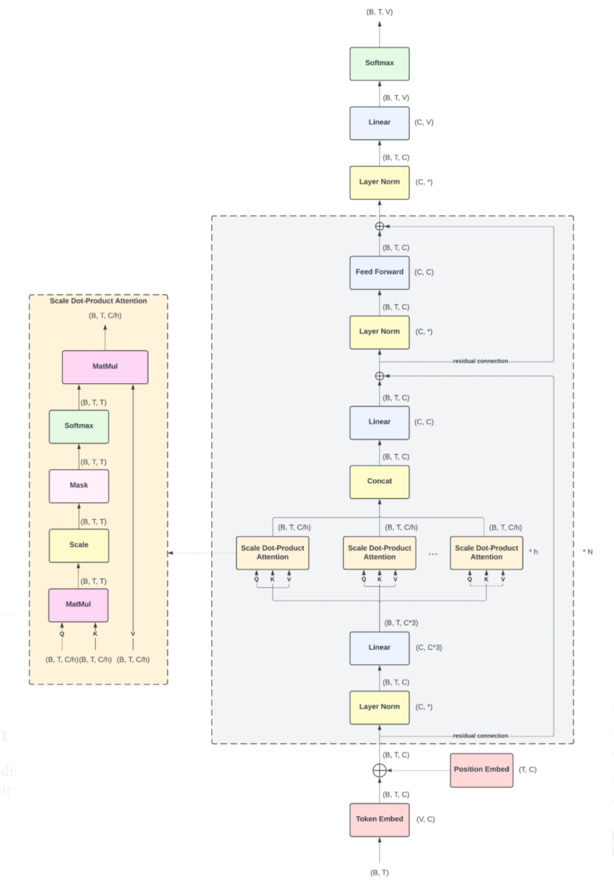
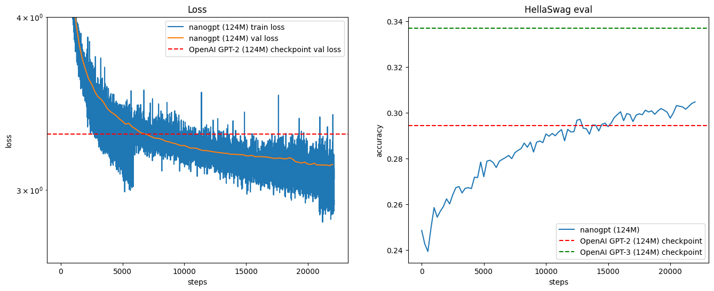

# GPT-2 Training from Scratch

This project involves training GPT-2 (124M parameters) from scratch using PyTorch. The model was trained using a fineweb-edu dataset and optimized for performance with multi-GPU support.

## Key Features
- **Framework**: PyTorch
- **Architecture**: GPT-2 124M trained from scratch
- **Multi-GPU Training**: Leveraged PyTorch Distributed Data Parallel (DDP)
- **Dataset**: fineweb-edu dataset

## Architecture
Below is a visual representation of the GPT-2 124M architecture:

## Training Process
1. **Data Preparation**: Preprocessed the dataset to ensure compatibility with the GPT-2 tokenizer.
2. **Model Initialization**: Implemented GPT-2 architecture and initialized weights.
3. **Optimization**: Used AdamW optimizer with learning rate scheduling for efficient training.
4. **Multi-GPU Setup**: Enabled DDP for scalable training.

## Results
Training performance and loss curve:

* only trained for 1 epoch or aprox 20,000 steps

## Transformer, GPT2, GPT3 paper used as reference
Transformers: https://arxiv.org/abs/1706.03762
GPT2: https://cdn.openai.com/better-language-models/language_models_are_unsupervised_multitask_learners.pdf
GPT3: https://arxiv.org/abs/2005.14165

Credit: Andrej Karpathy